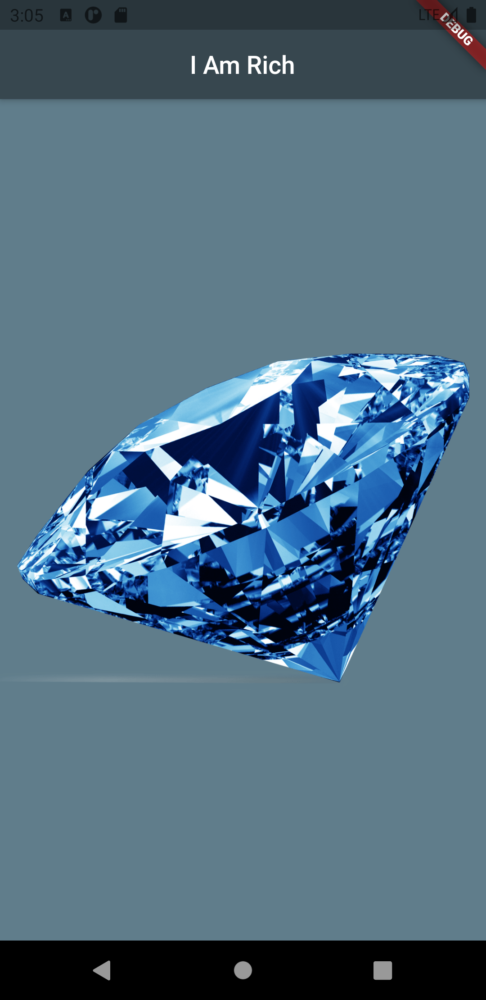

# I Am Rich

Created: Jun 10, 2021
Github: https://github.com/Ankitkj1999/i_am_rich_flutter
Level: Beginner
Status: In Progress 🙌

# Overview

This is a simple and static flutter application that displays an appbar and an asset image (diamond).

## GitHub

[Ankitkj1999/i_am_rich_flutter](https://github.com/Ankitkj1999/i_am_rich_flutter)

### Problem Statement

- This can be see and the introductiry app for the beginner.
    - Through this app I was to learns the use of basic widgets in flutter.

## Success Criteria

- The success criteria for this was to put an image and an appbar on the screen.

## Learnings

- Learned to put doen a very simple flutter app.

    ```dart
    import 'package:flutter/material.dart';

    void main() {
      runApp(
        MaterialApp(
          home: Scaffold(
            backgroundColor: Colors.blueGrey,
            appBar: AppBar(
              centerTitle: true,
              title: Text('I Am Rich'),
              backgroundColor: Colors.blueGrey[800],
            ),
            body: Center(
              child: Image(
                image: AssetImage('images/img3.png'),
              ),
            ),
          ),
        ),
      );
    }
    ```

- Use of [*Scaffold](https://api.flutter.dev/flutter/material/Scaffold-class.html)* widget.
    - In Scaffold I used the *[body*](https://api.flutter.dev/flutter/material/Scaffold/body.html) and *[appBar](https://api.flutter.dev/flutter/material/Scaffold/appBar.html)* parameters.
- Adding asset files and folders in the [*pubspec.yaml*](https://github.com/Ankitkj1999/i_am_rich_flutter/blob/master/pubspec.yaml) flile and then later using then on the app.

```yaml
# The following section is specific to Flutter.
flutter:

  # The following line ensures that the Material Icons font is
  # included with your application, so that you can use the icons in
  # the material Icons class.
  uses-material-design: true

  # To add assets to your application, add an assets section, like this:
  assets:
    - images/coal.png
```

- Creating app icons with  [*appicon.co*](http://appicon.co) and using then.
    - We can modify the fitting of the app icon through the android studio by following this path *android > app > src > main > res* and creating an *image asset* file.
- We can modify the name of the flutter app for android by modifying this path android > app  > src > main > AndroidManifest.xml. And for ios by modifying this path

## Scope

Simple flutter app just for learning purposes.

## Screenshots \ Gifs



I Am Rich Flutter App
